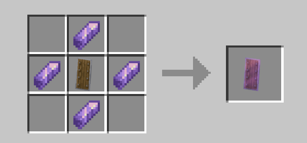
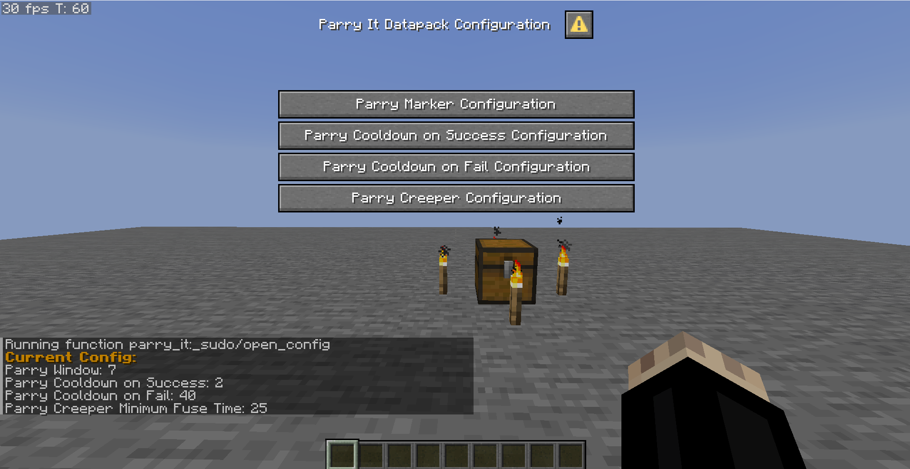

# Parry It Datapack

> Parry projectiles, creepers and damage!

## Introduction

This datapack features a new type of shield that allows the player to parry projectiles, creepers and damage.

## Installation

- Place the .zip in your world's datapacks folder

## Usage

- If you don't have the recipe use the `/reload` command to obtain it

- Craft the shield
  

## Parrying

- Right click it while holding it with your left or right hand to perform a parry

- By default, you have a 7 ticks (0.35 seconds) window to perform a parry, if you fail, you will be applied a negative effect and your parry cooldown is increased

- If you perform a succesful parry, it will reset your cooldown to 2 ticks

- Depending on what do you parry, it will give you different effects

### Damage Parry

- If you are hit while parrying, it blocks the damage and gives you strenght for a few seconds

- The mob/player that has hit you be given a slow and nausea effect

### Projectile parry

There are 3 types of projectiles, each one has a different effect when parried

- Absorbable (Wind Charges and Wither Skulls): Gives the player strenght and speed, and gives slowness to the mob/player that shot the projectile

- Deflectable (Arrows, tridents and throwable potions): Changes the direction of the projectile and gives slowness to the mob/player that shot the projectile

- Stopable (Fireballs): Stops in the air the projectile (and can be punch again) and gives slowness to the mob/player that shot the projectile

### Creeper Parry

- When in a 3 block radius from a creeper that is targeting you, using the shield around 5 ticks (0.25) right before it explodes, it will instantly do 1000 damage to the creeper

## Admin commands

- To give yourself a parry shield use the `/function parry_it:_sudo/give_shield` command

- To change the datapack configuration use the `/function parry_it:_sudo/open_config`, this will open a dialog and it will print out the current configuration in the chat

### Configuration

- `/function parry_it:_sudo/reset` sets the configuration to the default values

There are 4 types of values that can be modified inside the configuration dialog

> Note that all the values are in ticks: 20 ticks => 1 second

- Parry Window (7 ticks by default): It's the time between using the parry and failing it, a lower value requires the player to use it more precisely

- Parry Cooldown on Success (2 ticks by default): It's value of the cooldown after a successful parry, a lower value allows to use it right before a parry

- Parry Cooldown on Fail (40 ticks by default): It's value of the cooldown after a failed parry and the duration of the negative effects, a higher value punishes more the player

- Parry Creeper Minimum Fuse Time (25 ticks by default): It's the creeper fuse time required to parry a creeper successfully, a lower value allows to parry creeper earlier and less risky

> It's highly recommended to use a higher parry window and lower creeper minimum fuse time in servers, lag can make this datapack very inconsistent

## Video

## Compatibility

This datapack has been tested with minecraft +1.21.8
